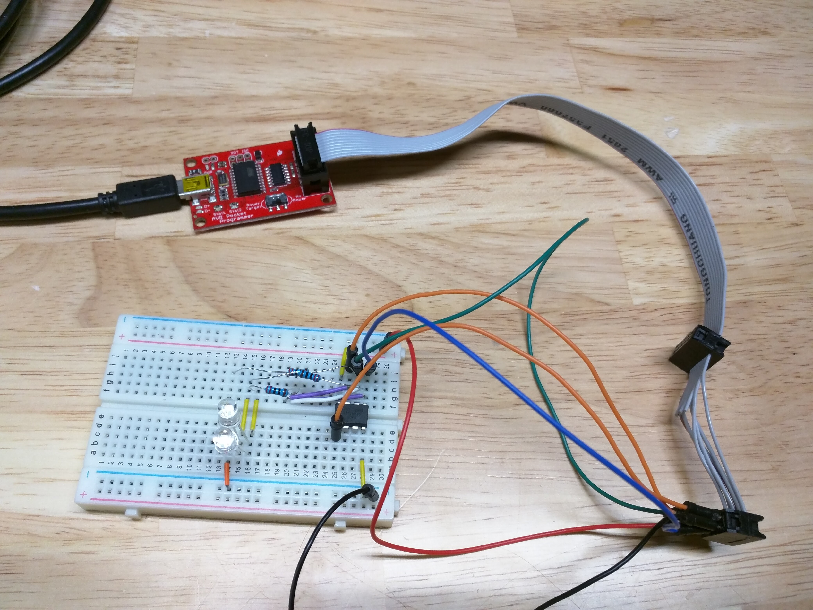
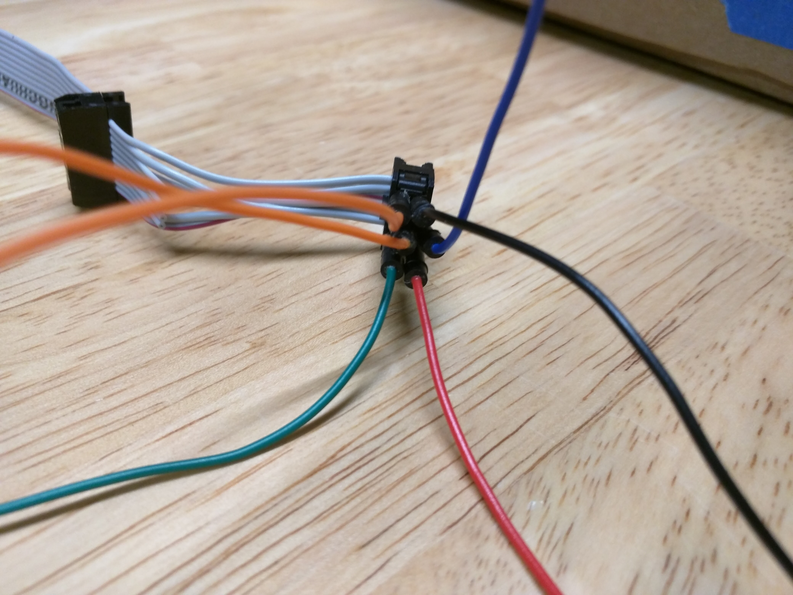
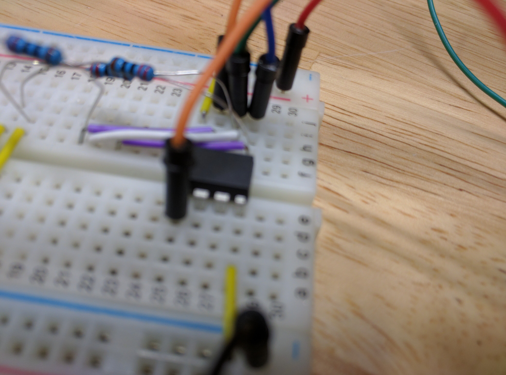
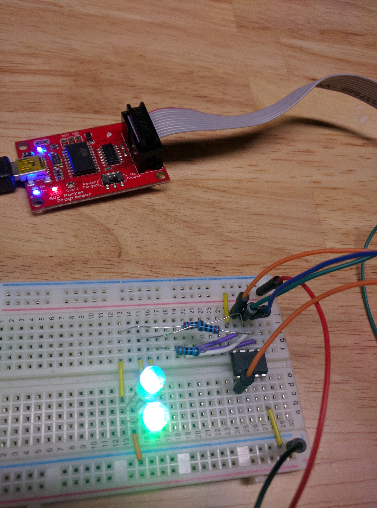
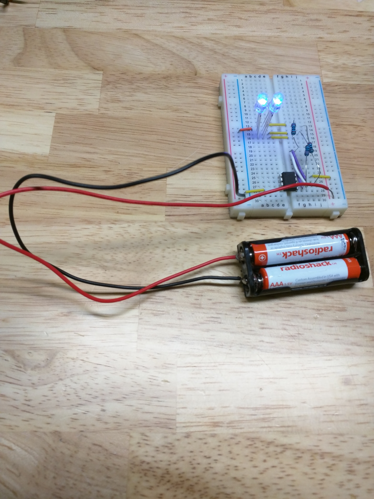
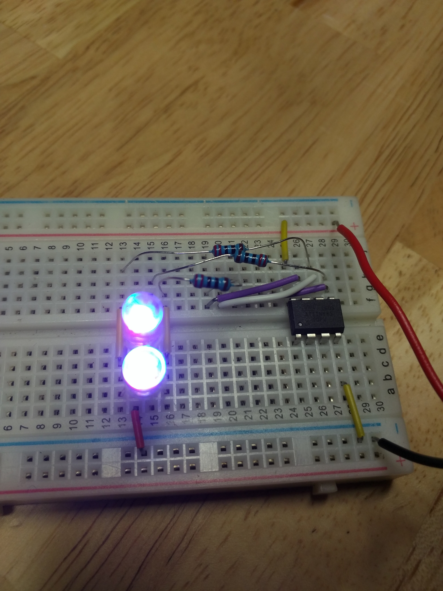

# Moodlight with ATtiny85

### Components
- 1x ATtiny85
- 3x 370 Ohm resistors
- 2x RGB LEDs
- 1x Sparkfun AVR pocket programmer

### References

- [Pocket AVR Programmer Hookup Guide](https://learn.sparkfun.com/tutorials/pocket-avr-programmer-hookup-guide)

### Programming
Using the AVR pocket programmer, connect up the pins, including power and ground, to the breadboard.

Using the `Makefile`, you can issue `make install` and it will use AVRDude to compile and push the program over to the ATtiny85.

### Running
Connect a power source between 3-5V, such as 2 AA batteries in series.

